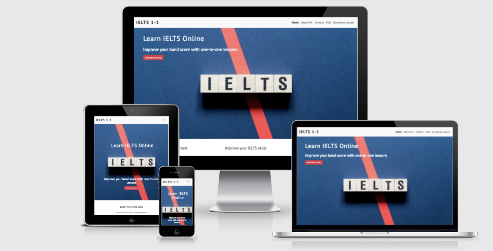
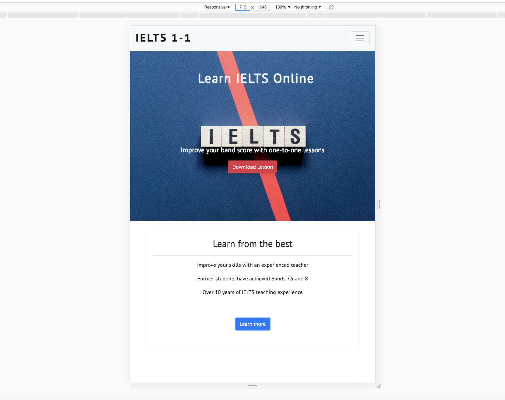
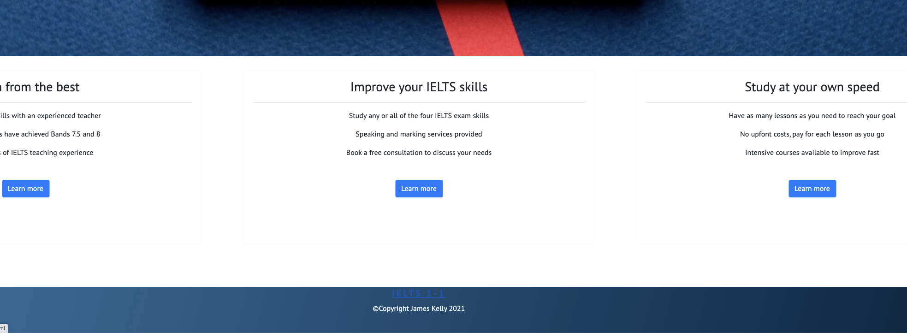
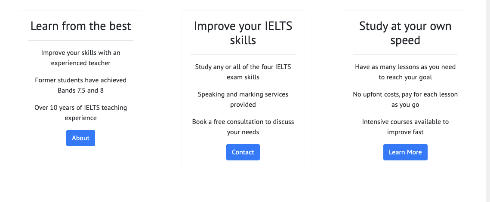
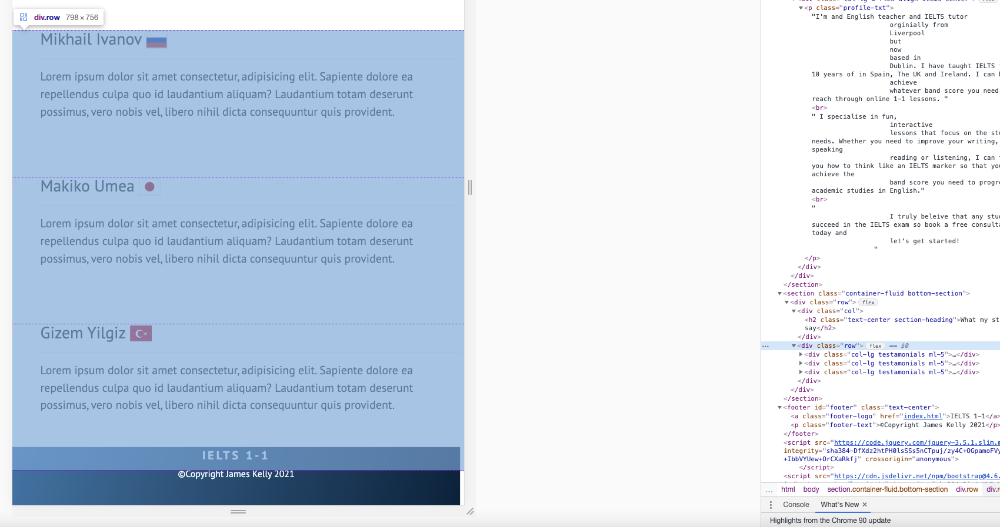

# **IELTS 1-1 Website**




## **Project Goals**

The primary goal of this site is to provide information to prospective students and to encourage them to enquire about one-to-one online tuition for the IETLS English Language exam . 

## **UX**

### *User goals*

The central audience for this site is English as a foreign language(EFL) students over the age of 18 who are planning to take the IELTS exam to enter university in and English-speaking country. 

### **Site user goals**

To find key information about IELTS tuition including:

*   Pricing of lessons
*   Structure and timing of lessons
*   How a tutor could help them achieve their academic goals
*   How soon they can achieve their goals
*   Information about the experience and teaching style of the tutor

This site will meet these goals because

*   Pricing information will be clearly presented at the top of an ‘FAQ’ page
*   Options regarding structure and timing of lessons will be clearly and simply presented in the ‘FAQ’ page.
*   A contact form will allow students to highlight their specific needs and goals, and directly tell the tutor what they want to achieve and when they need to achieve it
*   An ‘About Me’ page will provide the student with information about the tutor’s experience and provide testimonials from ex-students. 
*   A free PDF lesson will be available to download to give the student an example of the teaching methods and style of the tutor.

## **Wireframes**

[Wireframes](assets/wireframes.bmpr)


### **User Story**
	
As a student who is considering 1-to-1 IELTS online tuition, I want:

1. Information presented in a clear and easy to understand English.
2. Information about the tutor’s experience with the IELTS exam.
3. Examples of the tutor’s teaching materials.
4. Information about the tutor’s method and style of teaching.
5. The ability to find the exact cost of lessons.
6. The ability to communicate to the tutor my exact goals and what I need to improve.

## **Features**

*Existing Features*

The site contains four pages:

1. Home page  with hero image, basic information about the lessons and links to each of the three other pages and a download link to a free PDF lesson.

2. An About Me page detailing tutor experience and testimonials from students.

3. A contact form allowing students to detail key information about their needs and academic goals. 

4. An FAQ page answering some common questions potential students might have including pricing, structure and timing of lessons with a contact email address included in case they have any further questions.

*Potential Future Features*

* An embedded Example video lesson and video testimonials from students.  
* An expanded download section 

## **Technologies Used**

### **Languages Used**
* [HTML5](https://html.com/html5/)
* [CSS3](https://www.w3.org/Style/CSS/Overview.en.html)

## **Frameworks, Libraries & Programs Used**
* [Bootstrap 4](https://getbootstrap.com/)
    * Imported CSS and JS, utilised grid system, navbar, form control and accordian components.

* [Google Fonts](https://fonts.google.com/)
    * Google fonts were used to import the 'PT Sans' font into the style.css file which is used on all pages throughout the project.

* [Git](https://git-scm.com/)
    * Git was used for version control by utilizing the Gitpod terminal to commit to Git and Push to GitHub.

* [Github](https://github.com/)
    * GitHub is used to store the projects code after being pushed from Git.

* [Balsamiq](https://balsamiq.com/)
    * Balsamiq was used to create the wireframes during the design process.

* [Flag-Icon-CSS](https://github.com/lipis/flag-icon-css)
    * This library was used to import Flag icons next to student's testamonials.


## **Testing**

### **Automated Testing**

The W3C Markup Validator and W3C CSS Validator Services were used to validate every page of the project to ensure there were no syntax errors in the project.

* [W3C Markup Validator] (https://validator.w3.org/) 
* [W3C CSS Validator] (https://jigsaw.w3.org/css-validator/)


### Lighthouse score

The lighthouse score in google chrome developer tools was used on each page. Results were imoproved for SEO by adding a meta tag in hte head decribing the website's content and by compressing the hero and profile images. 


[Homepage](assets/images/screenshots/lighthouse-report-homepage.png)

[About Me ](assets/images/screenshots/lighthouse-report-aboutme.png)

[Contact ](assets/images/screenshots/lighthouse-report-contact.png)

[FAQ ](assets/images/screenshots/lighthouse-report-faq.png)


## **Testing User Stories from User Experience (UX) Section**
    

 As a first-time user of the site who is considering 1-to-1 IELTS online tuition, I want:

1. Information presented in a clear and easy to understand English.
    * The site's homepage cosists of a navigation bar with four clear options. A simple hero image that clearly states that this is a site related to the IELTS exam.
    * A user can understand the basic premise of the website from the two headings (written in plain English) "Learn IELTS Online" and "Improve your band score with one-one lessons" as the primary service this website is offering is online 1-1 IELTS lessons. 
    * The background of all sections of the website has been designed to be minimal and free from clutter or unncesccasry images in order to not distract a site user and all language has been kept to plain English as much as possible. 
    
2. Information about the tutor’s experience with the IELTS exam.
    * A site user can learn more about the teacher from the 'Learn from the best' sub section on the homepage or visit the About Me page in which there is a profile image, a brief article about the tutor's experience and student testamonials.

3. Examples of the tutor’s teaching materials.
    * A site user can download an example of the tutor's teaching material by clicking the download button on the hompage or the link in the navigation bar. 

4. Information about the tutor’s method and style of teaching.
    * The site offers an about me page which not only gives information about the ttutor but also their methods of teaching. The student testamonial section also offers site users an oppurtunity to learn about what other studetns say about the tutos teaching methods and styles.

5. The ability to find the exact cost of lessons.
    * A site user can easily find the price of lessons and extra infomration realated to timings and schedules by navigating to the FAQ page via the navigation bar or the link in ht esub-section of the homepage. Upon enetering the FAQ page the accordian of frequently asked quesiton is open on the question
    what is the cost of the lessons, so that students can easily find out this key information without having to click on any of the links. 

6. The ability to communicate to the tutor my exact goals and what I need to improve.
    * A site user has the option to contact the tutor by filling in a contact form. By providing basic information about themselves and their English learning background the user can contact the tutot to book a free consulation in regards to booking lessons. There is a text area in which the student can express their goals more clearly. 
    * In the FAQ page there is also a link to the tutors email address from which the suer can ask any questions not answered in the FAQ section.  


### **Browser Compatibilty**

The Website was tested on Google Chrome , Internet Explorer, Microsoft Edge and Safari browsers.

### **Devices**

The website was designed on a MacBook Pro Laptop using a thudnerbolt display and was tested on the following devices
* iPhone X 
* iPad 3
* Iphone 6 

### **Manual Testing Procedure**

All steps were taken on Google Chrome, Firefox, Safari and Internet Explorer on a Thunderbolt Dsiplay at two different desktop screen resolutions and subsequently an Iphone X screeen, iPad 4, and iPhone 6.


### **Elements on each page.**

1. Navbar
    * Hover over each link to check hover effect is working.
    * Click IELTS 1-1 navbar brand to check it brings user to the homepage.
    * Click the **Home** link to check it brings user to the homepage.
    * Click the **About** link to check it brings user to the about me page and **About** link is selected.
    * Click the **Contact** link to check it brings user to the contact page and **Contact** link is selected.
    * Click the **FAQ** link to check it brings user to the FAQ page **FAQ** link is selected.
    * Click the **Download Lesson** link to check it sucessfully downloads a copy of the Free Lesson PDF.
    * Check on mobile screen that nav bar collapses correctly into hamburger and all links work as above. 

2. Footer
    * Click the **IELTS 1-1** Logo to check it brings used back to hompage from all other pages. 

### **Homepage**

1. Hero Image 
    * Check Hero Image loads quickly and is displayed clearly.
    * Check Heading a re clear and easy to read.
    * Hover over button to check hover effect works
    * Click download button to check it successfully donwloads the Free Lesson PDF.
    * Check that headings are centered and the sub-heading and buttons are arranged beneath the central logo of the hero-img on mobile screens. 

2. Learn More Section
    * Check text is easy to read.
    * Hover over blue buttons to check if effect is working properly.
    * Check that the 3-column layout is arranged horizontally on desktop screens.
    * Check that the 3-column layout is arranged vertically on Tablet and Mobile screens.

### **About Me Page**

1. Profile Image
    * Check image loads quickly and is displayed clearly.
    * Check image is displayed on the left of the screen on desktop screens.
    * Check image is centered , below the section heading, on tablet and mobile screens. 

2. Profile text
    * Check text is easy to read and understand.
    * Check tex column is aligned to the right on desktop screens .
    * Check text column is centered below the profile image on tablet and mobile screens.

3. Testamonials Section
    * Check Student' name is clear to read and is displayed before the flag icon.
    * Check flag icon is clear and is displaying correctly.
    * Check 3-Column column layout on desktop is horizontally alinged.
    * Check that the 3-colum layout on tablet and mobile is displayed vertically. 


### **Contact Page**

1. Contact form

    * Click send with all inputs empty to check required filed error appears on name.  
    * Click name input field to check highlighting effect is working.
    * Enter name and click send to check  that the form alerts me to enter a valid email.
    * Click email input field to check highlighting effect is working.
    * Enter email address without @ symbol to check that the form alerts me to enter a valid email address.
    * Click dropdown button on nationality input to check that nationaly list appears.
    * Hover over  nationality input to check that form asks me to select an item in list.
    * Click dropdown button on first language input to check that languages list appears.
    * Hover over  nationality input to check that form asks me to select an item in list.
    * Click dropdown button on Current English Level input to check that English Level list appears.
    * Hover over  Current English Level to check that form asks me to select an item in list.
    * Click dropdown button on Required IELTS score input to check that Required IELTS score list appears.
    * Hover over  Required IELTS score input to check that form asks me to select an item in list.
    * Click each of the check boxes on and off to confirm that all can be selected and de-selected. 
    * Send form without inputting any text inot the more inofmraiton box to check that the form alrets me that it is a required field.
    * Send form with only required fields completed to check no required input messages appear. 


### **FAQ Page**

1. FAQ Accordion 

    * Check that the 'What is the price?' card is always selected and open when page loads.
    * Check that the 'What is the price?' card closes when the title or the plus symbol is clicked . 
    * Check that the plus symbol changes to a minus symbol and the 'What is the price' closes when another card is selected in the accordion.
    * Check that the 'How long is each lesson?' card opens and closes when the title or the plus symbol is clicked . 
    * Check that the plus symbol changes to a minus symbol and the 'How Long is each lesson' closes when another card is selected in the accordion.
    * Check that the 'How many lessons can I book?' card opens and closes when the title or the plus symbol is clicked . 
    * Check that the plus symbol changes to a minus symbol and the 'How many lesson can I book?' closes when another card is selected in the accordion.
    * Check that the 'Can I get a discount if I book more lessons?' card opens and closes when the title or the plus symbol is clicked . 
    * Check that the plus symbol changes to a minus symbol and the 'Can I get a discount if I book more lessons?' closes when another card is selected in the accordion.
    * Check that the 'How will the lessons be structured?' card opens and closes when the title or the plus symbol is clicked . 
    * Check that the plus symbol changes to a minus symbol and the 'How will the lessons be structured?' closes when another card is selected in the accordion.
    * Check that the 'How long will it take to reach my goal?' card opens and closes when the title or the plus symbol is clicked . 
    * Check that the plus symbol changes to a minus symbol and the 'How long will it take to reach my goal' closes when another card is selected in the accordion.
    * Check that the 'What materials do I need?' card opens and closes when the title or the plus symbol is clicked . 
    * Check that the plus symbol changes to a minus symbol and the 'What materials do I need?' closes when another card is selected in the accordion.
    * Check that the 'Can you just mark my writing and speaking?' card opens and closes when the title or the plus symbol is clicked . 
    * Check that the plus symbol changes to a minus symbol and the 'Can you just mark my writing and speaking?' closes when another card is selected in the accordion.
    


### **Bugs**

### Solved Issues 

1. On the homepage the sub-heading was too close to the centre of the hero-imgfrom resolutions widths of 452px up to 719 px  and was being slightly obscured by the shadow on the image. 



The cause of the issue was that the media query  set up to move the subheading below the center of the hero image was only set up for tablet resolutions and above. 


The media query was changed to incorporate resolutions from width from 452 and above screen sizes to fix the issue.


2. The IELTS 1-1 logo in the footer when hovered over would turn blue therefore making it difficult to read on the. blue background of the footer. The issue being that even though text-decoration was set to none, the colour was still set to the default blue for links. 



The solution was to target the footer id and the hover pseudo class and add the following CSS code

    ```
    #footer>a:hover {
    text-decoration: none;
    color: aliceblue}
    ```


3.  The most significant issue related to the buttons in the learn more section on the homepage. Early on I ran into the problem that because the text above the buttons was of differeing length, the horizontal alingment of the buttons would not match due to the content above it.
    The first step I took to solve this issue was instead of using a simple botostrap 3-column layout, I utlised the bootsrap card-deck component to help with the resonsiveness. Hwoever the issue was still apparent.



The issue was finally solved with the help of the codeinstitute tutor support and the use of a min-height for each card body and positioning the buttons absolutley at the bottom of each card body. 
 

``` .btn-blue {
    position: absolute;
    left: 50%;
    transform: translate(-50%, 0);
}
```


Then media queries were used to ensure that at each breakpoint in which the cards where hortizontally aligned there was enough space for the buttons to remain hroizontally aligned and not overlap with the text above them.  
```
@media screen and (min-width:1440px) {
    section-details .card-body {
        min-height: 300px;
    }

    .btn-blue {
        position: absolute;
        left: 50%;
        transform: translate(-50%, 0);
        bottom: 100px
    }
}
```

4. One bug noted during the testing period was that the contents of the about me page were not taking up 100% of the width of the viewport meaning that on mobile and desktop there was always a small empty space to the right of all of the containers. When scrolling on mobile this became particularly notable. This bug was not present on any of the other pages. 



The issue was solved by going through each element on the page in chrome developer tools and locating which element was causing the overspill. As the screenshot above shows, the element causing the issue was the row above the three columns for the student testamonials.

To solve the issue I separated the section heading and the three columns into their own containers and rows as shown in the code snippet below. 
```
<header class="container-fluid">
        <div class="row">
            <div class="col">
                <h2 class="text-center section-heading">What my students say</h2>
            </div>
        </div>
    </header>
    <section class="container-fluid bottom-section">
        <div class="row">
            <div class="col-lg testamonials">
```
## Deployment


## Credits

### Code


[Bootstrap4](https://getbootstrap.com/)  grid system a was used to make the site responsive and the class library was used for componenents and styling. 

The dropdown list of nationalities in the contact form came from this [github gist post](https://gist.github.com/didats/8154290)

The dropdown list of languages in the contact form came from this [stack overflow post](https://stackoverflow.com/questions/38909766/list-of-all-country-languages-for-dropdown-select-menu-html-form)

The background linear-gradient color of the footer was created by uploading the hero image to this [CSS Gradient Generator] (https://cssgradient.io/)

The flag icons for the student testamonials were imported from this [library] (https://github.com/lipis/flag-icon-css)

The Plus/ Minus icons on for the Bootstrap FAQ accordion was adapted from this [codepen] (https://codepen.io/kamelagandhi/pen/WjOpVY)

The sticky footer code was adapted from this [youtube video](https://www.youtube.com/watch?v=qlCIXXhSX6Y&t=385s&ab_channel=DaniKrossing)


### Content

All of the site content was written by the developer- with the exception of the student testamonials - see acknowledgements below. 
The PDF download file was authored by the developer. 

### Media

The hero image was licensed from Adobe Stock Images
The profile image is the developer's own. 


### Acknowledgements 

My CodeInsitute mentor, Antonija Simic, for her thorough and constructive feedback.

My former students Mikhail, Makiko, and Gizem for their generous testamonials. 

My friends and family for helping testing the site.

Tutor support at Codeinstitue for their invaluable support and clear guidance. 


